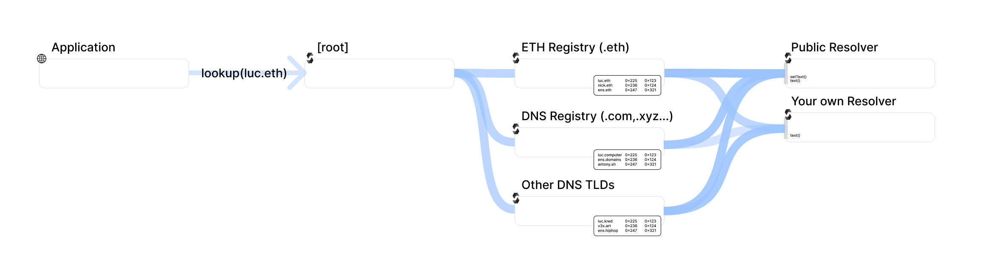

# ens-sps

- Links

  - Landing Page: https://ens.domains/
  - App: https://app.ens.domains/
  - Docs: https://docs.ens.domains/
  - Glossary: https://docs.ens.domains/terminology
  - Official Subgraph: https://thegraph.com/explorer/subgraphs/5XqPmWe6gjyrJtFn9cLy237i4cWw2j9HcUJEXsP5qGtH?view=Query&chain=arbitrum-one

- Protocol Summary

  - The Ethereum Name Service (ENS) is a distributed, open, and extensible naming system based on the Ethereum blockchain.
    - ENS maps human-readable names like 'alice.eth' to machine-readable identifiers such as Ethereum addresses, other cryptocurrency addresses, content hashes, metadata, and more.
    - ENS also supports 'reverse resolution', making it possible to associate metadata such as primary names or interface descriptions with Ethereum addresses.

- Core Concepts

  - Resolution: The process by which we load information about a name is called resolution. All ENS resolution starts on Ethereum Mainnet.
    <details>
        <summary>Forward Resolution, used to go from name to address (and load other extra data)</summary>

        1. Find the resolver for name from querying the Registry
        2. Query addr() text() contenthash() abi() text() etc on the Resolver

    </details>
    <details>
        <summary>Reverse Resolution, used to go from address to name</summary>
        
        1. Find the resolver for addr.reverse from the Reverse Registrar
        2. Query name() on the Resolver

    </details>

    > Note: [Not all ENS names exit onchain](https://docs.ens.domains/web/enumerate#enumeration). Some non-second-level .eth names can be managed off-chain and are resolved by offchain resolvers

  

  - Name Processing: domain names are not stored in their human readable format in the ENS smart-contracts, but in a uint256 encoded format [namehash](https://docs.ens.domains/resolution/names#namehash)
    - a [third party on-chain tool](https://etherscan.io/address/0x4a5cae3ec0b144330cf1a6cead187d8f6b891758#readContract#F4) to get namehash from domain name

- Contracts

  - Registry
    - all ENS lookups start by querying the registry
    - maintains a list of domains, recording the owner, resolver, and TTL for each, and allows the owner of a domain to make changes to that data
    - Registrars: Top-Level Domains (TLDs), like .eth, .com, and .test, are owned by smart contracts called registrars, which specify rules governing the allocation of their names
      - ETH Registrar: in charge of the ".eth" TLD
        - Base Registrar: is responsible for name ownership, transfers, etc
        - Registrar Controller: is responsible for registration & renewal
      - DNS Registrar: in charge of the DNS names like .com, .net, .xyz etc TLD
      - Reverse Registrar: allows users to register their preferred name, referred to as their "primary name" for simplicity purposes
  - Resolver
    - resolvers have control over the resolution process of a "node" (a name or subdomain) and onwards (subdomains of itself)
    - default resolver for all names is the Public Resolver, but it's possible to write Custom Resolvers with added functionality
  - Name Wrapper
    - allows issuance of on-chain subdomains in the form of ERC1155 NFTs, which can be transferred, sold, or traded

- Substream Development

  - Contracts/Events

    - .eth names

      - ERC-721 names

        ```
        [Old Registrar Controller](0x283af0b28c62c092c9727f1ee09c02ca627eb7f5)
        event NameRegistered(string name, bytes32 indexed label, address indexed owner, uint cost, uint expires);

        [Base Registrar](0x57f1887a8BF19b14fC0dF6Fd9B2acc9Af147eA85)
        event Transfer(address indexed from, address indexed to, uint256 indexed tokenId);
        ```

      - ERC-1155 names

        ```
        [Registrar Controller](0x253553366Da8546fC250F225fe3d25d0C782303b)
        event NameRegistered(string name, bytes32 indexed label, address indexed owner, uint cost, uint expires);

        [Name Wrapper](0xD4416b13d2b3a9aBae7AcD5D6C2BbDBE25686401)
        event TransferSingle(address indexed,address indexed,address indexed,uint256, uint256);
        event TransferBatch(address indexed,address indexed,address indexed,uint256[],uint256[]);
        ```

    - DNS names

      ```
      [DNS Registrar](0xb32cb5677a7c971689228ec835800432b339ba2b)
      event Claim(indexed bytes32,indexed address,bytes,uint32);

      // to decode dnsname: https://docs.ens.domains/resolution/names#dns
      ```

  - Modules
    - `map_events`:
      takes Block and maps into Event - NameRegistered / Transfer / TransferSingle / TransferBatch / Claim proto
    - `store_incoming_ens_names_by_users`:
      On incoming transactions (NameRegistered or Transferred_to), the name gets appended to a list of names with owner address as key in store_incoming_ens_names_by_user.
    - `store_outgoing_ens_names_by_user`:
      On outgoing transactions (Transferred_from), the name gets appended to a list of names with owner address as key in store_outgoing_ens_names_by_user.
    - `store_ens_names_by_user`:
      store_incoming_ens_names_by_user and store_outgoing_ens_names_by_user are fed to store_ens_names_by_user, which takes the delta of the two lists per user - the resultant list is the current ownership of names
      This is the store to look up name by user address
    - `store_user_by_ens_name:` converts names_by_user to user_by_names
      This is the store to look up user address by name
  - Expected behaviour

    ```
    event: NameRegistered(name: "N1", owner: "O1")
    store_incoming_ens_names_by_user: { "O1": "N1" }
    store_outgoing_ens_names_by_user: {}
    store_ens_names_by_user: { "O1": "N1" }
    store_user_by_ens_name: { "N1": "O1" }

    event: NameRegistered(name: "N2", owner: "O1")
    store_incoming_ens_names_by_user: { "O1": "N1,N2" }
    store_outgoing_ens_names_by_user: {}
    store_ens_names_by_user: { "O1": "N1,N2" }
    store_user_by_ens_name: { "N1": "O1", "N2": "O1" }

    event: NameRegistered(name: "N3", owner: "O1")
    store_incoming_ens_names_by_user: { "O1": "N1,N2,N3" }
    store_outgoing_ens_names_by_user: {}
    store_ens_names_by_user: { "O1": "N1,N2,N3" }
    store_user_by_ens_name: { "N1": "O1" }

    event: NameRegistered(name: "N4", owner: "O2")
    store_incoming_ens_names_by_user: { "O1": "N1,N2,N3", "O2": "N4" }
    store_outgoing_ens_names_by_user: {}
    store_ens_names_by_user: { "O1": "N1,N2,N3", "O2": "N4" }
    store_user_by_ens_name: { "N1": "O1", "N2": "O1", "N3": "O1" }

    event: Transfer(from: "O1", to: "O2" name: "N2")
    store_incoming_ens_names_by_user: { "O1": "N1,N2,N3", "O2": "N4,N2" }
    store_outgoing_ens_names_by_user: { "O1": "N2" }
    store_ens_names_by_user: { "O1": "N1,N3", "O2": "N4,N2" }
    store_user_by_ens_name: { "N1": "O1", "N2": "O2", "N3": "O1", "N4": "O2" }
    ```

- Usage

```bash
substreams build
substreams run -e mainnet.eth.streamingfast.io:443 \
   substreams.yaml \
   map_test_3 \
   --start-block 9380410 \
   --stop-block +100 \
   --debug-modules-output store_incoming_ens_names_by_user,store_outgoing_ens_names_by_user,map_test,store_ens_names_by_user,map_test_2,store_user_by_ens_name,map_test_3
```
